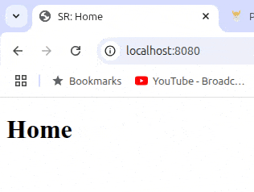

# TOP - Basic Informational Site

## Summary

An introduction to Node.js. This project uses `HTTP` to `createServer()` and URL parameters to navigate through the site. It also includes a `404.html` page to handle the UI when an error occurs.

## Model



## Project Highlights:

- Using `HTTP` to set up the server.
- Leveraging `createServer()` to create the server and write headers.
- Utilizing `URL` to parse the URL and access the pathname from the user.
- Employing `path` and `extName` to check the URL's extension and append `.html` if it's missing to locate the correct file.

## Challenges Overcome:

- Accessing the URL and extracting the pathname.
- Reading and writing files using the HTTP response and `fs`.
- Redirecting users to the correct page when they include the `.html` extension in the URL.

## New Skills Acquired:

- Creating a server and reading/writing files to it.
- Manipulating the URL to locate the correct file.
- Handling 404 errors and redirecting users to the error page.
- Improving the URL structure by removing the `.html` extension and serving the correct file.

## Technologies Used:

- HTML
- Node.js
- JavaScript

## How to Clone

To clone this project to your local machine, follow these steps:

1. Open your terminal and navigate to the directory where you want to clone the project.
2. Run the following command:

   ```bash
   git clone https://github.com/SReddy-96/TOP-node-basic-site.git
   ```

3. Navigate into the project directory.
   ```bash
   cd TOP-node-basic-site
   ```
4. Install any dependencies (if applicable) and start the server:
   ```bash
   node index.js
   ```
5. Open your browser and navigate to http://localhost:8080(or the port specified in your server file).
